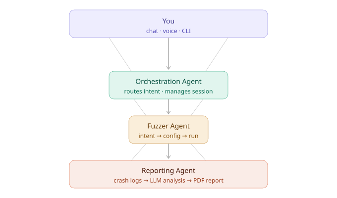

<p align="center">
  
</p>

<h1 align="center">Fuzzie</h1>
<p align="center"><em>Talk to it. It breaks Wi-Fi.</em></p>

<p align="center">
  
  
  
</p>

---

Fuzzie is a Wi-Fi protocol fuzzer you control through conversation. Instead of memorizing CLI flags or protocol theory, you describe what you want to test — Fuzzie figures out the rest, runs the fuzzer, and hands you a report when something breaks.

Built for **802.11**, but the architecture is intentionally protocol-agnostic.

---

## The Idea

Traditional protocol fuzzers are powerful but annoying to use. You need to know the exact frame types, field offsets, mutation strategies — before you've even started testing. We wanted something where you could just say *"fuzz beacon frames on this router"* or *"intern here: boss told me to fuzz test, pls help!"* and have it work.

So we built a three-layer agent system:

<p align="center">
  
</p>

Each layer is independent — you can swap the chat interface, the fuzzer engine, or the LLM without touching the rest.

---

## What's Working

- **Conversational interface** via Telegram — send a message, get fuzzing or use it like a chatbot to digest protocol documentation
- **LLM-driven config generation** — describe your target device, the agent generates fuzzer parameters or send them in natural language
- **Live status updates** — progress streams back to your chat as it runs
- **Crash detection + PDF reports** — when something breaks, you get a structured report in your company's format with CVE correlation through RAG

---

## What's WIP

> *Hackathon build — these sections aren't done yet*

- [ ] **Other chat/voice interfaces** — architecture supports it, adapters not built
- [ ] **Non-802.11 protocols** — Bluetooth/Zigbee support is on the roadmap

---

## Quick Start

**Prerequisites:** Python 3.7+, a wireless adapter that supports monitor mode, an LLM API key (Gemini or OpenAI)

```bash
git clone https://github.com/yourusername/fuzzie.git
cd fuzzie


TBD
```

Then in Telegram:
1. `/start`
2. Pick **"Let's start Fuzzing!"**
3. Describe what you want to test — e.g. *"fuzz beacon frames on a TP-Link router"*
4. Confirm the config it generates
5. Watch it run

---

## Learning Mode

Not just a fuzzer — you can also ask it questions about 802.11 frames, protocol internals, or Wi-Fi security concepts. The orchestration agent switches modes automatically based on what you're asking.

---

## Extending It

The three-layer split makes swapping things out straightforward:

- **Different chat platform?** Easily Integrable 
- **Different protocol?** Replace the core CLI tool with a Bluetooth/Zigbee fuzzer
- **Different LLM?** We support `BYOK`

---

## License

[Unlicense](https://unlicense.org) — public domain, do whatever you want with it!
